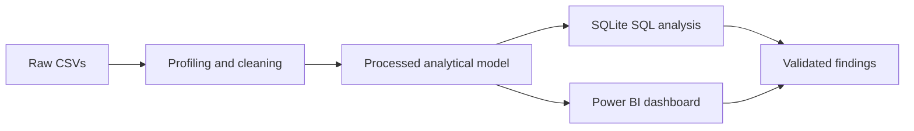
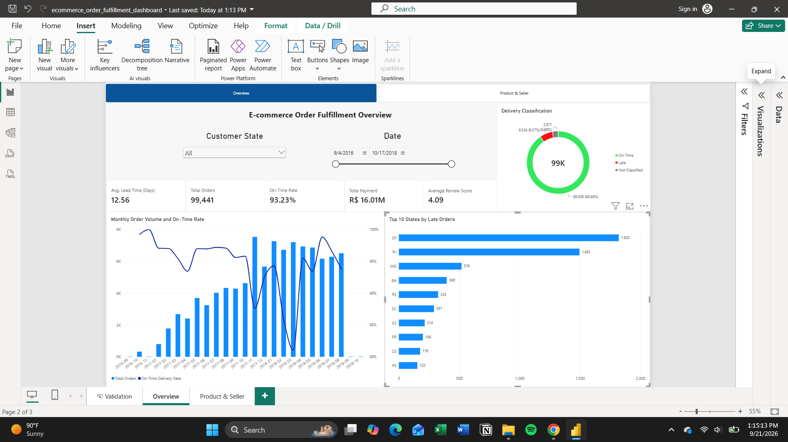
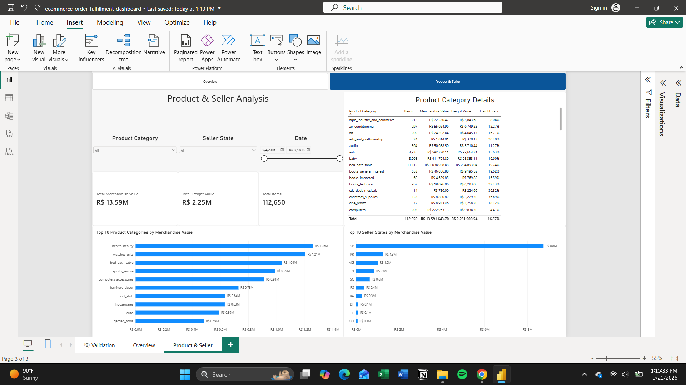

# E-commerce Order Fulfillment Analysis

An independent portfolio case study using the public Olist e-commerce dataset. This project turns raw marketplace CSV extracts into validated analytical tables, an interactive Power BI dashboard, and reproducible SQLite analysis. It is not affiliated with Olist.

## Executive summary

The analysis covers **99,441 orders** and **112,650 items**. Of **96,470 classified delivered orders**, **89,936 were on time** and **6,534 were late**, for a **93.23% on-time delivery rate**. Average valid lead time was approximately **12.56 days** and late orders averaged approximately **10.62 days** beyond the estimated delivery date. The case study highlights March 2018 (81.04%) and customer state AL (78.59%, among qualifying states) as priorities for investigation—not proof of root cause.

## Business problem and objectives

How can an e-commerce operation monitor fulfillment reliability while keeping order-level and item-level measures analytically sound?

The project objectives were to profile source quality, build a documented native-grain model, validate delivery and commercial metrics, surface fulfillment patterns in Power BI, and translate observed patterns into evidence-aware recommendations.

## Analytical questions

- What share of classified delivered orders arrived on time, and how long did fulfillment take?
- Which complete purchase months and qualifying customer states had the weakest observed on-time rates?
- How are merchandise value and freight distributed across product categories and seller states?
- How common are repeat purchasers when customers are identified by `customer_unique_id`?
- What data-quality conditions limit lifecycle and delivery interpretation?

## Workflow



## Tools and technologies

Python (pandas, Jupyter), SQLite, SQL, Power BI, DAX, Markdown, and Git.

## Analytical data model

The processed model has `fact_orders` (one row per order), `fact_order_items` (one row per `order_id` + `order_item_id`), and customer, product, and seller dimensions. `DimDate` is created in Power BI. The [model specification](docs/power-bi-model-spec.md) and [DAX measures](docs/dax-measures.md) document relationship directions, types, and measure definitions.

### Order grain versus item grain

Fulfillment, status, payment, review, and lifecycle measures belong at **order grain**. Merchandise value, freight value, and item count belong at **item grain** for category and seller analysis. This separation prevents one-to-many joins from inflating order measures; delivery, payment, and review measures are not interpreted by product category or seller state without a separately designed allocation method.

## Data-quality controls

Raw files are retained unchanged. Independent aggregations prevent order-count multiplication, keys and relationships are validated, and lifecycle anomalies remain visible rather than being corrected away. Delivery is classified only for delivered orders with a customer delivery timestamp; on-time includes delivery on or before the estimated calendar date. The detailed controls are in the [data-quality report](docs/data-quality-report.md), [cleaning rules](docs/cleaning-rules.md), and [validation scripts](python/03_power_bi_validation.py).

## Key findings

- **96,478** orders were delivered; **2,971** were not classified for delivery timeliness.
- March 2018 was the lowest qualifying complete month at **81.04%** on time. Boundary months **2016-09** and **2018-10** are excluded from month-to-month comparison.
- AL was the lowest qualifying customer state at **78.59%** on time (397 classified orders).
- Item-grain merchandise value was **R$13,591,643.70** and freight value was **R$2,251,909.54**.
- **2,997 of 96,096** distinct customers were repeat customers, an approximately **3.12%** repeat-customer rate.

See the [SQL analysis](docs/sql-analysis.md) for tables and definitions.

## Recommendations

Use March 2018 and AL as investigation queues, monitor late orders using classified-order denominators, review freight burden by category at item grain, and evaluate seller-state concentration as an operational exposure rather than a causal explanation. Improve lifecycle timestamp completeness and sequence controls before widening duration-based reporting. The full decision framing—including evidence still needed—is in [business recommendations](docs/business-recommendations.md).

## Dashboard

### Overview



### Product and seller analysis



## Repository structure

```text
data/       Raw (ignored) and processed (ignored) CSV layers
dashboard/  Power BI screenshots; PBIX is intentionally excluded
docs/       Data quality, model, SQL, recommendations, and reproduction notes
python/     Profiling, cleaning, analysis, and validation notebooks/scripts
sql/        SQLite views and eight labeled business queries
testing/    SQL regression tests
```

## Reproducibility

Raw and processed CSVs are intentionally Git-ignored. Obtain the public raw dataset, place it in `data/raw/`, then follow the [project reproduction guide](docs/project-reproduction-guide.md). The Power BI `.pbix` file is not included in Git; screenshots document the implemented report.

## Limitations

This anonymized, observational dataset cannot establish why performance differs across months, locations, categories, or seller states. Merchandise value is not revenue or profit; it excludes costs, refunds, and margin. Missing lifecycle timestamps and retained invalid sequences limit duration coverage. The customer dimension is order-level, so repeat behavior uses aggregated `customer_unique_id` rather than a relationship key.

## Skills demonstrated

Data profiling, reproducible cleaning, dimensional modeling, grain-aware metric design, SQL analysis, DAX/Power BI reporting, automated validation, and clear evidence-aware business communication.
